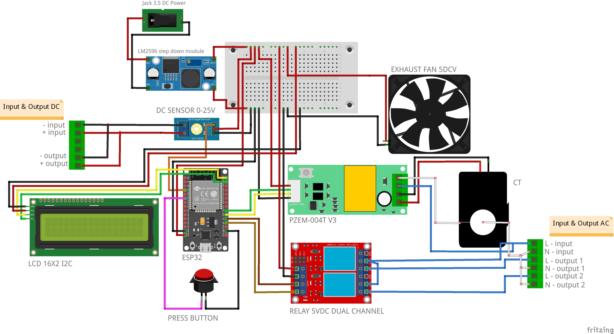
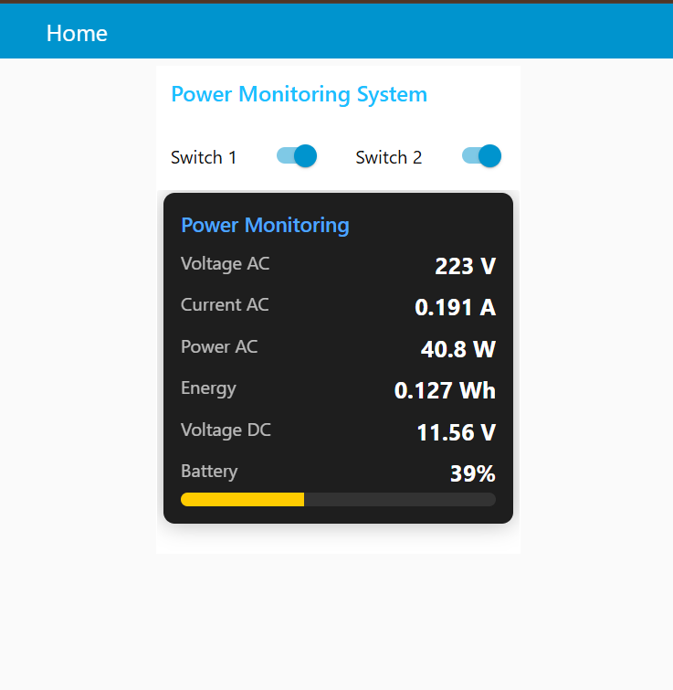

# ⚡ Power Monitoring System (IoT)

A complete **IoT Power Monitoring & Control System**. This project measures AC/DC parameters and enables remote relay control via MQTT dashboards (Node-RED/Mobile App).

---

## 🚀 Features
- **Dual Monitoring:** Real-time AC (Voltage/Current) via PZEM-004T & DC Voltage monitoring.
- **Remote Control:** 2-channel relay control via MQTT subscription.
- **Smart Connectivity:** Auto-reconnect system for WiFi and MQTT broker.
- **Local Display:** LCD 16x2 with a mode selector button to switch between AC/DC data.
- **Dashboard Ready:** Integrated seamlessly with Node-RED for visualization.

---

## 🛠️ Hardware Components

| Component | Function |
| :--- | :--- |
| **ESP32 DevKit v1** | Main MCU & Gateway IoT |
| **PZEM-004T v3.0** | AC Voltage & Current Sensor |
| **DC Voltage Sensor** | Up to 25V measurement |
| **Relay 2-Channel** | Remote switch for AC/DC loads |
| **LCD 16x2 (I2C)** | Visualizing data without a dashboard |
| **LM2596 Buck Converter** | Voltage regulator for stable 5V input |
| **5V Mini Cooling Fan** | Thermal management for the enclosure |

> **Note:** The system uses a DC Barrel Jack for flexible power input and Terminal Blocks for secure high-voltage wiring.

---

## 🔌 System Architecture
1. **Sensing:** ESP32 reads data from PZEM-004T (AC) and Analog Pins (DC).
2. **Processing:** Data is formatted into JSON/Strings.
3. **Communication:** ESP32 publishes data to the MQTT Broker via WiFi.
4. **Action:** Node-RED subscribes to telemetry and publishes commands to control the relays.

---

## 🔌 Wiring & Pinout

### Wiring Diagram

### Pinout Mapping
| Component Pin | ESP32 GPIO | Description |
| :--- | :--- | :--- |
| **PZEM TX / RX** | GPIO 16 / 17 | Serial2 Communication |
| **LCD SDA / SCL** | GPIO 21 / 22 | I2C Communication |
| **Relay 1 / 2** | GPIO 4 / 2 | Load Control (Output) |
| **DC Sensor** | GPIO 34 | Analog Input (ADC) |
| **Push Button** | GPIO 32 | Mode Switch (Input Pullup) |

---

## 📚 Library Dependencies
Please install these libraries via Arduino Library Manager before uploading:

* **PZEM-004T v3.0** (by Jakub Maziewski)
* **PubSubClient** (by Nick O'Leary)
* **LiquidCrystal I2C** (by Frank de Brabander)
* **WiFi** (Built-in ESP32)
* **Wire** (Built-in)

---

## ⚙️ Installation & Setup

1. **Hardware:** Wire the components according to the `Wiring Diagram`.
2. **Firmware:**
   - Open `src/main.ino` in Arduino IDE.
   - Change `ssid` and `password` to your WiFi credentials.
   - Update `mqttServer` if using a private broker.
   - Upload the code to your ESP32.
3. **Dashboard:**
   - Open Node-RED.
   - Import `dashboard/flows.json`.
   - Configure the MQTT In/Out nodes to match your broker.

---

## 📸 Demo & Screenshots

---

## ⚠️ Disclaimer
This project involves **High Voltage AC**. Always ensure proper insulation and safety measures when wiring the PZEM-004T sensor and Relay modules.

---
**Developed with ❤️ by [ramaariw]**

